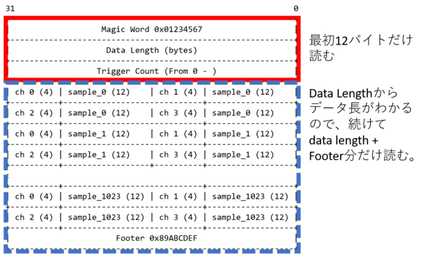

(テーマ)ファイルを読んでデコード
================================

ローデータをデコードできるようにする。

実習内容
--------

実習に使うソフトウェアエミュレータからとったデータをデコードするルーチンを書く。
できたデコードプログラムは最終的にDAQ-Middlewareコンポーネントに
組み込むことになる。

データフォーマット
------------------

まずデータフォーマットをしらなければならない。
データフォーマットは ~/daqmw-tc-network-2/doc/data-format.pdf にある。
Linux上でPDFファイルを読むにはevinceプログラムを使う:

    % evince ~/daqmw-tc-network-2/doc/data-format.pdf

ヘッダ部と、データ部にわかれている。
ヘッダ部の長さは12バイトで固定である。

- Magic Word (0x12345678) デコードする際にこの値になっていなければどこかで
おかしなことになっていたことがわかる。
- Data Length データ部分の長さ。単位はバイト。ヘッダの長さはこのフォーマットでは
入っていない(ヘッダの長さを含める流儀もある)
- トリガーカウント 最初は0。トリガーがかかるごとに1づつ増える(という想定)

次にデータ部が続く。
データの部分は1チャンネル、1サンプルあたり16ビットである。
上位4ビットはチャンネル番号を表す。
のこり12ビットがデータとなる。

     15             8|7             0
     +-+-+-+-+-+-+-+-+-+-+-+-+-+-+-+-+
     | | | | | | | | | | | | | | | | |
     +-+-+-+-+-+-+-+-+-+-+-+-+-+-+-+-+
             |       |
     <-------><---------------------->
       CH #         ADC  Data

今回エミュレータが送ってくるデータは各チャンネル1024サンプルである。
データ数が変わる場合はヘッダのData Lengthから計算で求めたりする。

ソフトウェアエミュレータからのデータの取得と表示
------------------------------------------------

ncコマンドを使って実際にエミュレータからデータを読んでファイルに
リダイレクトしてみる:

    % daqmw-tc-emulator -D (-Dはデーモン化するオプション)
    % timeout 5 nc localhost 1234 > data
    5秒待つと終了する

取得したデータはhexdumpコマンド、xxdコマンドで見ることができる。
ここではxxdコマンドを使ってみる。

    % xxd data
    % xxd sample.dat | head
    00000000: 0123 4567 0000 2000 0000 0000 0000 1000  .#Eg.. .........
    00000010: 2000 3000 0000 1000 2000 3000 0000 1000   .0..... .0.....
    00000020: 2000 3000 0000 1000 2000 3000 0000 1000   .0..... .0.....
    (以下略)

このようにデフォルトでは16バイトづつ、hexで表示される。

-c 4とすると4バイトごとにhexで表示されるようになる。

    % xxd -c 4 sample.dat | head
    00000000: 0123 4567  .#Eg
    00000004: 0000 2000  .. .
    00000008: 0000 0000  ....
    0000000c: 0000 1000  ....
    00000010: 2000 3000   .0.
    (以下略)

-c 4を付けるとフォーマット表と照合しやすくなる。

-bを付けるとhexではなく2進数で表示されるようになる。

    % xxd -b -c 4 sample.dat | head
    00000000: 00000001 00100011 01000101 01100111  .#Eg
    00000004: 00000000 00000000 00100000 00000000  .. .
    00000008: 00000000 00000000 00000000 00000000  ....
    0000000c: 00000000 00000000 00010000 00000000  ....

実際にやってみて、フォーマット表と見比べて、理解が正しいかどうか
確認しておく。

行う作業内容
------------

プログラムは ~/daqmw-tc-network-2/bs/read_file_decode/ にあるのでこれをコピーして
使う:

    % cd ~/daqmw-tc-network-2/sandbox
    % cp -r ../bs/read_file_decode .

デコード部分のメソッドが書いてないのでこれを埋めること。

サンプルデータは ~/daqmw-tc-network-2/bs/sample.dat にある。
このファイルのデータ部をデコードして

    trg: XXX ch: XXX sample: XXX data: XXX

と表示するプログラムを書く。

ファイル

* Makefile
* RawDataPacket.h     デコードルーチンクラスファイル
* RawDataPacket.cpp   デコードルーチンクラス実装(各メソッドが書いてないので埋める)
* read_file_decode.cpp fread()を使ってファイルを読む(このなかでRawDataPacketで実装したメソッドを使っている。main()はこのなかにある)。

実装するメソッド(ヘッダデータを読むところ)

* is_valid_magic()
* is_valid_footer()
* get_data_length()
* get_trigger_count()

* get_word_size(): 1データサイズ。今回は2バイト固定なので常に2を返すようにしてある。
データフォーマットによりこの情報もヘッダに含まれていることがある。
* get_num_of_ch(): チャンネル数。今回は4チャンネルなので常に4を返すようにしてある。
データフォーマットによりこの情報もヘッダに含まれていることがある。

データ部を読むところ

* get_data_at(int ch, int window)

データ部はwindowごとにまとまっていてひとつのチャンネルのデータが連続している
わけではない。デコードする際にはチャンネルごとのデータがほしいことが多いかと
思うので、引数にチャンネル番号、windowを指定することにした。

解答例
------

各メソッドを実装したものを ~/daqmw-tc-network-2/bs/read_file_decode/ においてある。

図
--------

---

[ex07](../ex07/)
